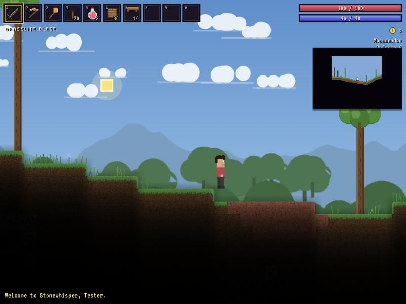
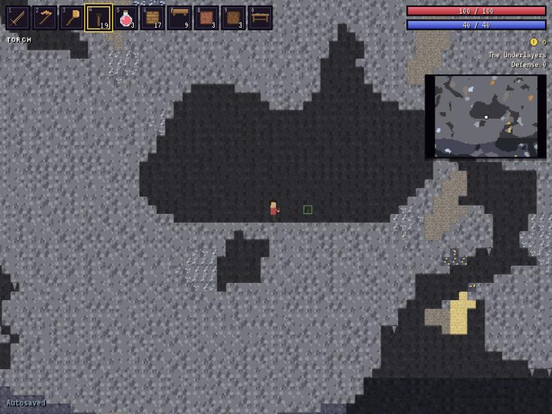
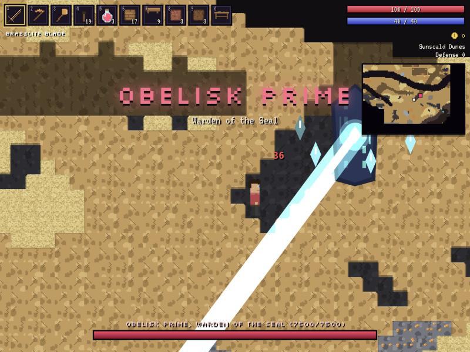
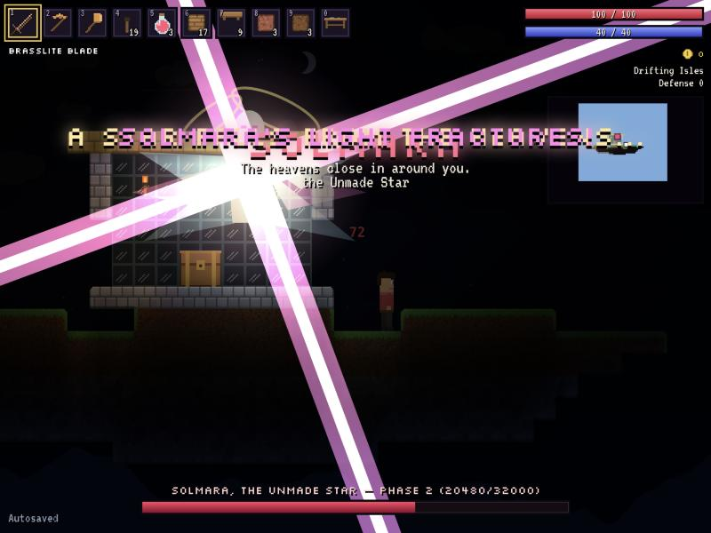
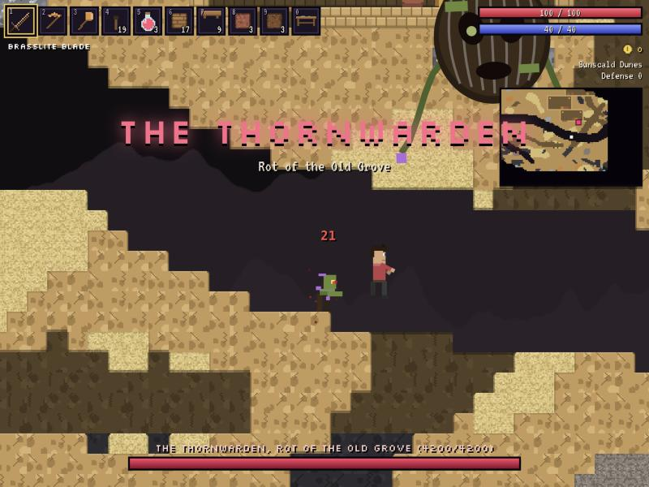
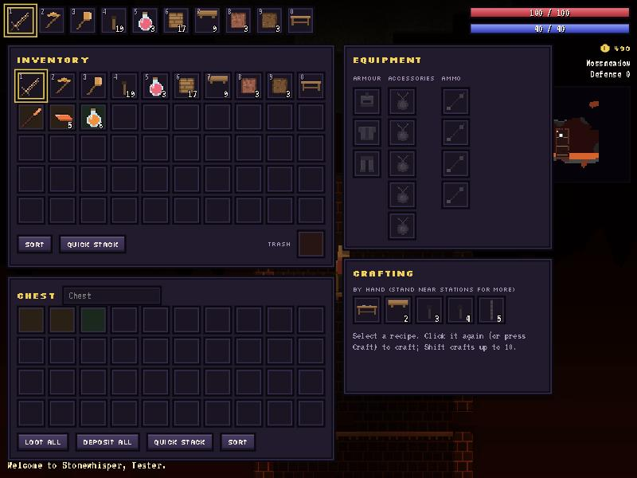
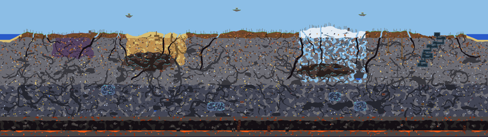

# Veinreach

*Dig deep. Reach further.*

Veinreach is a browser-based 2D sandbox survival adventure written in TypeScript. You dig through a procedurally generated world, build a home, craft gear, and fight your way through five bosses. Defeating the third boss breaks the ancient Seal that holds the world together, which permanently transforms the world.

Everything is original: the world, the lore, the names, the pixel art (generated procedurally at runtime) and the audio (synthesised with the Web Audio API). There are no external art or sound assets.

## Screenshots

| | |
|---|---|
|  |  |
|  |  |
|  |  |

A full generated world (medium) rendered from its map colours:



## Features

- **Procedural worlds** (small, medium or large) built from a seed. Layered noise terrain, ridged-noise tunnels, cavern chambers and random-walk worms are combined with cellular-automata smoothing.
  - **Biomes:** Mossmeadow, Sunscald Dunes, Rimefrost Taiga, Blightmire, Saltreach Shore, Sporeglow Caverns, Glimmer Hollows and Emberdeep.
  - **Structures:** Warden's Keep dungeon, sky isles, sunken vaults, mineshafts, ruins, cabins, crystal shrines, ashen spires and Vital Crystal chambers.
- **Chunked world** of 32×32-tile chunks with cached chunk render surfaces, dirty tracking and LRU unloading. Saves store the seed plus only the modified chunks.
- **Mining and building.** Tool power gates what you can mine, blocks take hardness-based damage with crack overlays, and there are walls, platforms, furniture, doors, torches, ropes, trees you can fell, and support cascades.
- **Player controller** with acceleration, coyote-time jumps, variable jump height, double jump, dash, rope climbing, fall damage, liquids, knockback and invulnerability frames.
- **Inventory:** 50 slots with a 10-slot hotbar, plus 3 armour, 5 accessory, 4 ammo and a trash slot.
  - Drag and drop, stack splitting, shift-click, ctrl-click to trash, sorting, quick-stack and tooltips.
- **Crafting:** 170 recipes across 7 crafting stations, detected automatically from nearby tiles. Some are gated on progression.
- **Combat:**
  - **Weapon types:** melee swings, spears, boomerangs, bows, crossbows, guns, wands, staves, tomes and summoned minions.
  - **Mechanics:** crits, knockback, status effects, explosions, homing and piercing projectiles, and damage numbers.
- **31 enemy types** across 14 AI archetypes, including jumpers, walkers, chargers, fliers, dive-bombers, burrowing ambushers, wall-climbing spiders, armoured rollers, worms, archers, teleporting casters, floating turrets, mimics and ghosts.
- **Five multi-phase bosses** with telegraphed hazards, phase transitions, invulnerability windows, summoned adds, lasers, bullet patterns and an arena ring. Each has its own boss music, intro and death sequence.
- **Progression:**
  - Ore tiers run Brasslite → Ferrocite → Moonsilver → Sungild → Glimmerite → Cindrite → Umbralite → Aetherium → Starsteel.
  - There are 12 armour sets with set bonuses and 23 accessories.
  - **The Unsealing** is the mid-game world transformation: a Shardblight scar opens across the land, new ores appear in the deep, and enemies grow stronger.
- **World events:** Gloamtide, Rustbound Raid (an invasion with a progress bar), Starfall (meteor crashes) and Veilstorm.
- **Weather:** rain, storms with lightning, snow and sandstorms, expressed per biome.
- **Seven NPCs** with housing validation, arrival conditions, dialogue, progression-based shops, a healer, selling and buyback.
- **Day/night cycle** with sky gradients, sun, moon phases and stars. Tile-based RGB light propagation covers torches, lava, glowing ores and entity lights.
- **Minimap and full world map** that show only explored terrain, with markers.
- **Saves in IndexedDB:** characters and worlds are stored separately, with autosave and JSON export/import. Imports are validated.
- **Menus:** title, character creation (hair, colours, difficulty), world creation, settings (audio, UI scale, zoom, shake, particles, key rebinding) and credits.
- **Experimental multiplayer** over a Node WebSocket server (see [Multiplayer](#multiplayer)).
- **Debug tools** for developers, disabled by default.

## Getting started

Requirements: Node.js 20 or newer.

```bash
npm install
npm run dev
```

Then open http://localhost:5173.

| Command | What it does |
|---|---|
| `npm run dev` | Start the Vite dev server |
| `npm run build` | Typecheck and build a production bundle into `dist/` |
| `npm run preview` | Serve the production build |
| `npm run test` | Run the Vitest suite (unit + headless simulation tests) |
| `npm run typecheck` | Typecheck the client and the server |
| `npm run server` | Start the multiplayer server (default `ws://localhost:7777`) |

Dev convenience: open `http://localhost:5173/?autoplay` to resume the most recent character and world directly.

## Controls

| Input | Action |
|---|---|
| A / D | Move |
| Space | Jump (hold for higher; double-jump with the right accessory) |
| W / S | Climb ropes; hold S to drop through platforms |
| Double-tap A / D | Dash (with a dash accessory) |
| Left click | Use item: attack, mine, place |
| Right click | Interact (doors, chests, beds, NPCs) or place |
| 1 – 0, mouse wheel | Select hotbar slot |
| E / Tab | Inventory and crafting |
| M | World map |
| H / J | Quick heal / quick mana |
| Q | Drop held item (Shift+Q drops the stack) |
| + / − | Zoom |
| C | Creative panel (Creative characters, or with Developer mode on) |
| Esc | Pause menu, or close panels |
| Enter | Chat (multiplayer) |
| \` | Debug console (Developer mode only) |

In the inventory, Shift-click quick-moves a stack, Ctrl-click trashes it, and right-click splits a stack or quick-equips armour. Every key can be rebound in **Settings → Key bindings**.

## How to play (progression)

1. **Early game.** Chop trees, mine Brasslite and Ferrocite, and build a Workbench, a Smelter and an Anvil. Build a house to attract the Pedlar. Find Vital Crystals underground to raise your maximum health.
2. **Gravelmaw, the Burrowing Tyrant.** Use a *Grubbling Lure* underground. Defeating it brings the Smith.
3. **The Thornwarden.** Plant a *Withered Seed* on the surface at night. Defeating it halts the spread of the Blightmire and brings the Explorer.
4. **Obelisk Prime.** Use a *Resonant Prism* in the deep caverns or the Glimmer Hollows. Destroying it **breaks the Seal**: the Unsealing begins, Umbralite and Aetherium appear, the Shardblight opens, the Archmage arrives, and the Aetherforge becomes craftable.
5. **Nhal'Zyra, the Emberwyrm.** Offer a *Brimstone Chalice* in Emberdeep.
6. **Solmara, the Unmade Star.** Raise an *Astral Sigil* to the night sky. This is the final boss, with three phases and an arena.

Housing rule: an NPC room needs player-placed background walls, a door (or platform), a light source, a table or workbench, a chair, and 60–750 enclosed tiles.

## Architecture

The code is TypeScript with a small, dependency-free engine on Canvas 2D. The UI is plain DOM with no framework. See [docs/ARCHITECTURE.md](docs/ARCHITECTURE.md) for details.

```
src/
  core/         Game (app root), GameSession (a running world), GameLoop, config, EventBus, context types
  engine/       InputManager, Camera
  world/        World, Chunk, TileRegistry, WorldActions (break/place/support), housing, objects
  generation/   WorldGenerator + passes (terrain, caves, biome regions, ores, liquids, structures, vegetation)
  structures/   Structure builders (Keep, cabins, isles, vaults, spires, shrines, mineshafts)
  biomes/       Tile-sampling biome detection
  entities/     Entity/Actor, Player, Enemy (+ ai/), bosses/, npcs/, Projectile, ItemDrop, EntityManager
  items/        Item types, ItemRegistry, stat aggregation
  inventory/    ItemContainer, cursor transfer rules, PlayerInventory
  crafting/     RecipeRegistry, CraftingSystem
  combat/       Damage maths, ItemUse (swinging, shooting, casting, placing, consuming)
  physics/      Tile collision, line of sight, liquid/contact queries
  systems/      Time, Progression, Mining, Building, Spawn, Loot, Buffs, Weather, WorldEvents, Liquids, RandomTicks, Unsealing
  lighting/     Tile-resolution RGB light propagation
  rendering/    TileRenderer (chunk caches), BackgroundRenderer, procedural sprites/
  particles/    Pooled particle system, floating combat text
  audio/        AudioManager, procedural SFX and generative music
  ui/           HUD, inventory/crafting/chest/shop panels, menus, minimap, debug console
  save/         SaveManager, IndexedDB/memory backends, serialisation, validation
  multiplayer/  Protocol, NetworkManager, RemotePlayer
  data/         All content: tiles, walls, items/, recipes, enemies, bosses, npcs, biomes, buffs, loot tables, projectiles
server/         Node WebSocket server (WorldHost + index)
tests/          Vitest unit + headless simulation tests
docs/           Architecture, progress, roadmap, design notes
```

## World generation

Generation is a deterministic pipeline of passes. Each pass gets its own RNG forked from the seed, so passes never perturb one another.

1. **Biome layout** assigns a surface biome to each column.
2. **Terrain:** a smoothed per-biome amplitude drives multi-octave heightmaps, then layered materials, patches and natural walls are laid down.
3. **Caves:** ridged-noise tunnels, fbm chambers, surface and deep worms, then a cellular-automata cleanup.
4. **Biome regions:** Dunes and Taiga extend underground, Blightmire chasms are cut, Sporeglow groves are placed, Glimmer Hollows are grown by a cellular automaton, and Emberdeep is carved.
5. **Ores** are placed as clustered random walks within depth bands. **Liquids** fill basins, underground lakes and lava lakes.
6. **Structures** are placed with protected-area masks so later passes don't damage them.
7. **Vegetation:** grass, trees per biome, plants, glowshrooms, crystals, vines and stalactites.

The same seed and size always produce the same world. This is covered by a test.

## Save system

- **IndexedDB stores:** `characters`, `worlds` (metadata and state), `chunks` (only modified chunks), `explored` (RLE-compressed map data) and `settings`.
- **Loading** a world regenerates it from its seed, then applies the saved chunks on top.
- **Autosave** runs every 45 s. The game also saves on returning to the menu, boss kills, NPC arrivals, event endings and the Unsealing. You can save manually from the pause menu.
- **Export/import** writes characters and worlds as JSON files. World chunk data is RLE-compressed and base64-encoded. Imports are validated and sanitised, and corrupt data is skipped rather than crashing the game.
- **Fallback:** if IndexedDB is unavailable (for example in some private windows), the game still runs but warns that progress won't persist.

## Multiplayer

**Status: experimental.** Single-player is fully independent of it.

```bash
npm run server -- --port 7777 --world "My Realm" --seed 12345 --size medium
```

Then choose **Multiplayer (Experimental)** in the main menu and connect to `ws://localhost:7777`.

What is synchronised (2–8 players):
- Terrain from the shared seed, plus server-held modifications.
- Block and wall edits. The server validates them (range, bounds, ids, rate limits), stores them and relays them to other players.
- Chests (validated), bucket liquids, time of day, world progression flags (a boss kill unlocks progression for everyone, including the Unsealing) and chat.
- Player avatars: position, animation, armour and held light.
- The server saves the world to `server/data/<world>.json` every minute and on shutdown.

What is **not** synchronised yet: creatures, bosses, projectiles, dropped items and liquid flow. These are simulated separately on each client. See [docs/ROADMAP.md](docs/ROADMAP.md).

## Extending the game

All content is data-driven and validated at startup. Problems are logged, and the tests fail on content errors.

### Adding a tile
Append a `TileDef` to `src/data/tiles.ts` with a new, unique numeric `id`. Ids are stored in save files, so only ever append. Give it a `texture` recipe (`soil`, `stone`, `ore`, `brick`…) or `kind: 'sprite'` plus a painter in `src/rendering/sprites/objectSprites.ts`. Multi-tile objects set `size: [w, h]`; crafting stations set `station`.

### Adding an item
Add an entry to the relevant file in `src/data/items/`: blocks, materials, tools, weapons, armour, accessories or consumables. Icons use templates from `src/rendering/sprites/itemIcons.ts`, recoloured by the `c` palette.

### Adding a recipe
Add `{ out, count?, ing: [[itemId, n], …], station?, requires? }` to `src/data/recipes.ts`.

### Adding an enemy
Add an `EnemyDef` to `src/data/enemies.ts`. Choose an existing `ai` archetype and tune it with `p`, pick a sprite `kind`, a loot table and spawn rules (biomes, zones, time, flags or events). For a new behaviour, add an `AIController` in `src/entities/enemies/ai/` and register it in `ai/index.ts`.

### Adding a boss
Add a `BossDef` to `src/data/bosses.ts`, subclass `Boss` in `src/entities/bosses/` (implement `think()` as an attack state machine and `draw()`), register its factory and summon rules in `BossManager`, and add a loot table plus a summon item.

### Adding music or sound files
Everything is synthesised by default. To use real files, drop them in `public/assets/audio/` and list them in `public/assets/audio/manifest.json`, for example `{ "sfx": { "hit": "sfx/hit.ogg" }, "music": { "day": "music/day.ogg" } }`. Files override the procedural sound with the same name.

## Creative mode (testing sandbox)

To try everything without progressing, create a character with the **Creative** difficulty, or turn on **Settings → Developer mode** for any character, then press **C** in game. The Creative panel has four tabs:

- **Items:** every item in the game, searchable and filtered by category. Click to get a full stack; Shift-click to get one.
- **Creatures & Bosses:**
  - Spawn any of the 5 bosses on the spot. Summoning conditions are ignored, and night is set automatically for night bosses.
  - Spawn any creature (Shift-click spawns 5) and clear enemies.
  - Set natural spawns to Off, Normal or High.
- **World:**
  - Time presets, plus freeze time and fast time.
  - Weather and world events (Gloamtide, Rustbound Raid, Starfall, Veilstorm); crash a meteor.
  - Progression flags (each boss defeated, the Unsealing), which unlock recipes, NPCs, shop stock and loot.
  - Teleports to every biome (surface and underground) and every structure type, and a map reveal.
- **Player:**
  - Cheats: god mode, fly (through terrain), instant mining (ignores tool power) and infinite items (free placing, ammo, mana and potions).
  - Gear presets that equip a full armour set, accessories, tools and weapons for four stages of the game.
  - Max life and mana, aurels, and set spawn.

A Creative character has no death penalty.

## Debug tools

Enable **Settings → Developer mode** to get the debug overlay (FPS, position, entity/chunk counts) and the `` ` `` console:

```
give <item> [n]   spawn <enemy> [n]   boss <id>   tp spawn|surface|cursor|<x> <y>
time <hour>|day|night   speed <n>   god   heal   light   chunks   hitboxes
flag <name>   event <id>|end   weather <kind>   explore   items [filter]   save
```

## Known limitations

- Multiplayer is experimental (see above).
- There are no slopes or half-blocks; collision is axis-aligned tiles with automatic one-tile step-up.
- There is no smart-cursor or vanity slots yet.
- Tile data for the whole world stays in memory (about 8 MB for a large world). Chunks are streamed for rendering and simulation, but not paged to disk.
- Liquids use a simplified cellular model.
- Fonts come from Google Fonts when online and fall back to monospace offline.

## Roadmap

See [docs/ROADMAP.md](docs/ROADMAP.md) and [docs/PROGRESS.md](docs/PROGRESS.md).

## License

Code: MIT. All game content (names, lore, procedurally generated art and audio) is original to this project.
